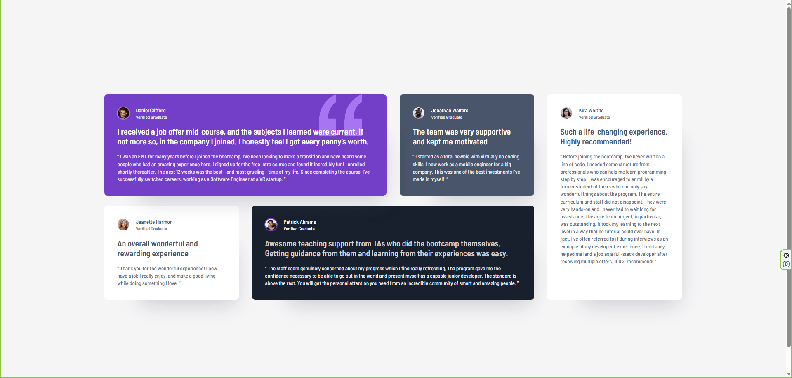

# Frontend Mentor - Testimonials grid section solution

This is a solution to the [Testimonials grid section challenge on Frontend Mentor](https://www.frontendmentor.io/challenges/testimonials-grid-section-Nnw6J7Un7).

## Table of contents

- [Overview](#overview)
  - [The challenge](#the-challenge)
  - [Screenshot](#screenshot)
  - [Links](#links)
- [My process](#my-process)
  - [Built with](#built-with)
  - [What I learned](#what-i-learned)
  - [Continued development](#continued-development)

## Overview

### The challenge

Users should be able to:

- View the optimal layout for the site depending on their device's screen size

### Screenshot



### Links

- [Solution Link](https://your-solution-url.com)
- [Live Site Link](https://your-live-site-url.com)

## My process

### Built with

- Semantic HTML5 markup
- Sass/SCSS - modular, variables, mixins
- Flexbox
- CSS Grid
- Mobile-first workflow
- [Vite](https://vite.dev/) - Build tool

### What I learned

This project was similar to the one I did before, and I used it as a chance to sharpen my CSS Grid skills even more. Along the way, I also picked up a couple of neat tricks.

1. Grid layout with `grid-template-areas`:
I used `grid-template-areas` again to set up the layout. This time, I had to tweak the column sizes a bit to get the spacing just right. Playing with the `grid-template-columns` helped me balance how much space each section takes up.

2. Profile pictures with a "fake" border:
The profile pictures had a border (or stroke), but it wasn’t part of the actual image. I could’ve used `box-sizing: content-box;`, but instead, I went with a little trick: I added a `box-shadow` that mimics a border. It doesn’t mess with the box model and still gives the same look. 😄

**Here’s a code snippet showing both things in action:**
```html
<header class="feature__header">
    
    <h3>Daniel Clifford</h3>
    <h4>Verified Graduate</h4>
</header>
```
```scss
.feature__header {
    display: grid;
    gap: 0.25rem 1.0625rem;
    grid-template-areas: 
    "left right1"
    "left right2";
    grid-template-columns: auto 1fr;

    &--img {
        width: 28px;
        height: 28px;
        border-radius: 100%;

        grid-area: left;
    }
    &--stroke-patrick {
        box-shadow: 0px 0px 0px 2px $color-8;
        -webkit-box-shadow: 0px 0px 0px 2px $color-8;
        -moz-box-shadow: 0px 0px 0px 2px $color-8;
    }
    &--stroke-daniel {
        box-shadow: 0px 0px 0px 2px $color-9;
        -webkit-box-shadow: 0px 0px 0px 2px $color-9;
        -moz-box-shadow: 0px 0px 0px 2px $color-9;
    }
}
```

### Continued development

I feel like really getting the hang of Grid will pay off in the long run. I don’t want to go too deep down the rabbit hole since I’m I want to start learning React soon, but I’ll definitely focus on Grid for a few more projects to solidify the basics.

Another thing I’ve noticed is that I’m becoming more aware of what my changes actually affect—whether it’s styling, logic, setup, or visuals in the browser. This awareness helps me stay on top of the project and know exactly where I am in the process. It’s also made my commit messages way more useful and organized. I’ve started using proper labels like `style:`, `chore:`, `fix:`, `feat:`, `refactor:`, and `docs:` more consistently, and I’ll keep working on that as well.